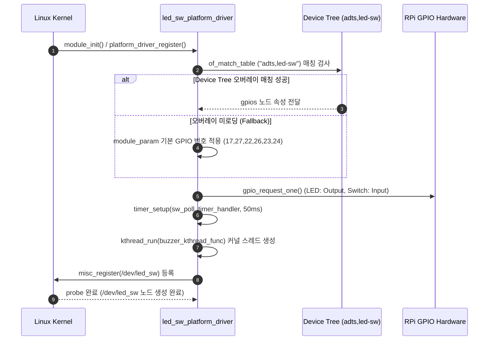
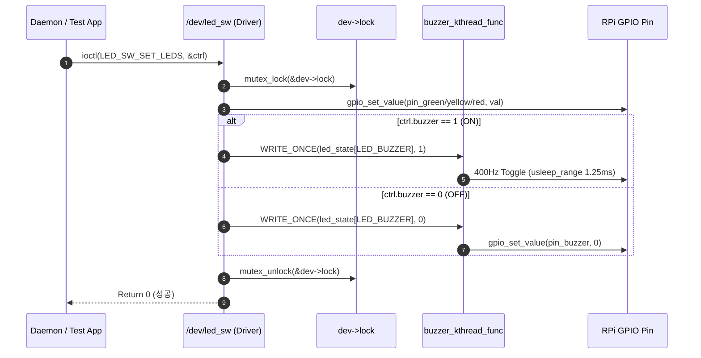
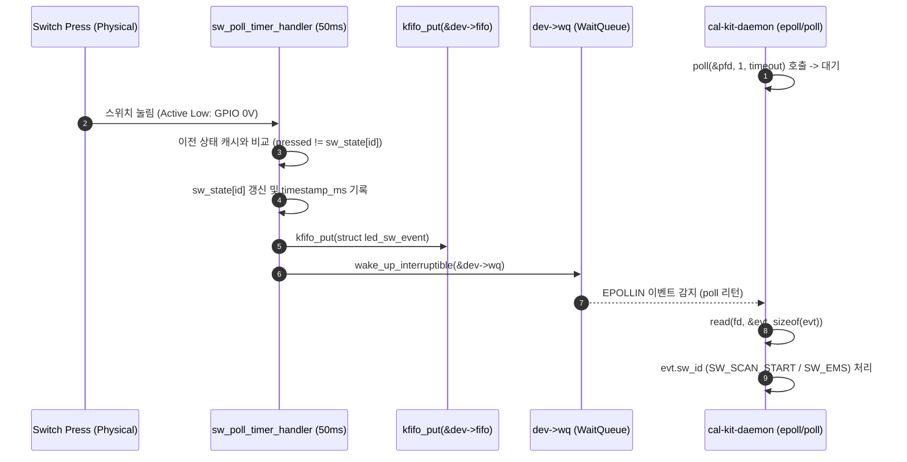

# [DeviceDriver] RPi GPIO LED·스위치·부저 통합 커널 드라이버 (/dev/led_sw) 기술 명세서 v2.1

> **작성자**: 강유근 (YOOGEUN KANG)
> **소속 / 프로젝트**: VEDA Oppenheimer Team / VEDA ADTS Project
> **문서 버전**: v2.1
> **개정일**: 2026-08-13
> **대상 모듈**: `/dev/led_sw` (RPi4 GPIO 직결 3색 LED + 2종 물리 스위치 + 수동 부저 통합 커널 드라이버)
> **관련 소스 파일**:
> - 커널 드라이버: `driver/led_sw_driver.c`
> - 공통 계약 헤더: `shared/led_sw.h`
> - Device Tree Overlay: `driver/overlays/led-sw-overlay.dts`
> - 유저 공간 데몬 모듈: `daemon/modules/led/led_module.c`
> - 검증 CLI 앱: `driver/led_sw_test.c`

---

## 1. 개요 및 개발 목적 (Overview)

### 1.1 배경 및 목적
본 모듈은 라즈베리파이4(Raspberry Pi 4) 단독 제어기 환경에서 외부 상태 표시용 **3색 LED (Green, Yellow, Red)**, 사용자 입력용 **물리 스위치 2종 (Scan Start, EMS)**, 및 알람/경보용 **수동 부저(Passive Buzzer)**를 효율적으로 통합 제어하기 위해 개발된 **단일 캐릭터 디바이스 드라이버 (`/dev/led_sw`)**입니다.

유저 공간 데몬이 sysfs/GPIO를 개별적으로 제어할 경우 발생하는 컨텍스트 스위칭 오버헤드와 비동기 스위치 이벤트 처리 지연을 방지하기 위해, **커널 공간 내 Misc Device 등록, `kfifo` 링버퍼 기반 비동기 이벤트 통지, BCM2835 Hardware PWM0 하드웨어 타이머(CPU 점유율 0%), 및 50ms 폴링 타이머 디바운스** 아키텍처를 적용했습니다.

### 1.2 주요 요구사항 및 상태 정의

| 구분 | 하드웨어 구성 요소 | 제어/감지 목적 | 시스템 동작 상태 연결 |
| :--- | :--- | :--- | :--- |
| **LED 0** | **Green LED** | 명령/스캔 제어 코드 동작 중 표시 | `LED_GREEN`: 스캔 진행 중 (`CMD_SCAN_START`) |
| **LED 1** | **Yellow LED** | 대기 상태(Idle) 표시 | `LED_YELLOW`: 명령 대기 중 |
| **LED 2** | **Red LED** | 비상/에러 상태 표시 | `LED_RED`: 시스템 에러 또는 비상 정지 발생 |
| **Buzzer** | **Passive Buzzer** | 경보음 및 조작 피드백 음 출력 | `LED_BUZZER`: BCM2835 Hardware PWM0 하드웨어 타이머 (2kHz 50% duty, CPU 점유율 0%) |
| **SW 1** | **Scan Start Switch** | 스캔 시작 비동기 트리거 | `SW_SCAN_START`: 눌림 감지 시 데몬에 이벤트 전달 |
| **SW 2** | **EMS Switch** | 즉시 정지(Emergency Stop) 트리거 | `SW_EMS`: 눌림 감지 시 즉시 비상 정지 로직 발동 |

---

## 2. 하드웨어 인터페이스 및 DeviceTree 명세 (HW Interface)

### 2.1 Raspberry Pi 4 BCM GPIO 핀 맵

드라이버는 모듈 파라미터(`module_param`) 기본값 및 Device Tree 노드 속성을 모두 지원합니다.

```
       RPi 4 GPIO Header Pin Map
       +-----------------------------------+
       | Pin 11 (GPIO 27) -> Green LED     | Active High
       | Pin 13 (GPIO 17) -> Yellow LED    | Active High
       | Pin 15 (GPIO 22) -> Red LED       | Active High
       | Pin 12 (GPIO 18) -> Passive Buzzer| Hardware PWM0 (2kHz)
       | Pin 16 (GPIO 23) -> Scan Start Sw | Active Low (Pull-Up)
       | Pin 18 (GPIO 24) -> EMS Switch    | Active Low (Pull-Up)
       +-----------------------------------+
```

| 기능 명칭 | BCM GPIO 번호 | Physical Pin | 전기적 특성 | 기본 동작 속성 |
| :--- | :--- | :--- | :--- | :--- |
| `gpios-led-green` | **GPIO 17** | Pin 11 | Output, Push-Pull | Active High (1 = ON, 0 = OFF) |
| `gpios-led-yellow` | **GPIO 27** | Pin 13 | Output, Push-Pull | Active High (1 = ON, 0 = OFF) |
| `gpios-led-red` | **GPIO 22** | Pin 15 | Output, Push-Pull | Active High (1 = ON, 0 = OFF) |
| `gpios-buzzer` | **GPIO 18** | Pin 12 | Hardware PWM0 | Active High (HW PWM 2kHz, 50% duty, CPU 0%) |
| `gpios-sw-scan-start`| **GPIO 23** | Pin 16 | Input, Internal Pull-Up | Active Low (0 = Pressed, 1 = Released) |
| `gpios-sw-ems` | **GPIO 24** | Pin 18 | Input, Internal Pull-Up | Active Low (0 = Pressed, 1 = Released) |

### 2.2 Device Tree Overlay (`driver/overlays/led-sw-overlay.dts`)

```dts
/dts-v1/;
/plugin/;

/ {
    compatible = "brcm,bcm2835";

    fragment@0 {
        target = <&gpio>;
        __overlay__ {
            led_sw_pins: led_sw_pins {
                brcm,pins = <17 27 22 23 24>;
                brcm,function = <1 1 1 0 0>; /* 1: Output, 0: Input */
                brcm,pull = <0 0 0 2 2>;     /* 0: None, 2: Internal Pull-Up */
            };
        };
    };

    fragment@1 {
        target-path = "/";
        __overlay__ {
            led_sw {
                compatible = "adts,led-sw";
                status = "okay";

                pinctrl-names = "default";
                pinctrl-0 = <&led_sw_pins>;

                gpios-led-green      = <&gpio 17 0>;
                gpios-led-yellow     = <&gpio 27 0>;
                gpios-led-red        = <&gpio 22 0>;
                gpios-sw-scan-start  = <&gpio 23 1>;
                gpios-sw-ems         = <&gpio 24 1>;
                gpios-buzzer         = <&gpio 18 0>;
                pwms                 = <&pwm 0 500000 0>;
                pwm-names            = "buzzer";
            };
        };
    };

    fragment@2 {
        target = <&pwm>;
        __overlay__ {
            status = "okay";
        };
    };
};
```

---

## 3. 커널 드라이버 아키텍처 및 주요 데이터 구조체 (Driver Architecture)

### 3.1 공통 데이터 인터페이스 계약 (`shared/led_sw.h`)

```c
#define LED_SW_DEV_NAME  "led_sw"
#define LED_SW_DEV_PATH  "/dev/led_sw"

/* LED 채널 ID */
enum led_channel {
    LED_GREEN  = 0,   /* 스캔/제어 코드 동작 중 */
    LED_YELLOW = 1,   /* 명령 대기 중           */
    LED_RED    = 2,   /* 에러/비상 발생        */
    LED_BUZZER = 3,   /* 부저 제어              */
    LED_MAX    = 4
};

/* 스위치 ID */
enum switch_id {
    SW_SCAN_START = 1,  /* 스캔 시작 (CMD_SCAN_START) */
    SW_EMS        = 2,  /* 즉시 정지 (CMD_DISARM)     */
    SW_MAX        = 3
};

/* 스위치 이벤트 구조체 (read() / poll() 비동기 스트리밍용) */
struct led_sw_event {
    led_sw_u8  sw_id;         /* enum switch_id (SW_SCAN_START, SW_EMS) */
    led_sw_u8  state;         /* 1 = Pressed, 0 = Released               */
    led_sw_u32 timestamp_ms;  /* 커널 틱 타임스탬프 (ms)                 */
};

/* LED 일괄 제어 구조체 (ioctl LED_SW_SET_LEDS) */
struct led_sw_ctrl {
    led_sw_u8 green;   /* 1 = ON, 0 = OFF */
    led_sw_u8 yellow;  /* 1 = ON, 0 = OFF */
    led_sw_u8 red;     /* 1 = ON, 0 = OFF */
    led_sw_u8 buzzer;  /* 1 = ON, 0 = OFF */
};

/* 전체 상태 조회 구조체 (ioctl LED_SW_GET_STATE) */
struct led_sw_state {
    led_sw_u8 leds[LED_MAX];    /* LED 및 부저 상태 */
    led_sw_u8 sw[SW_MAX];       /* 각 스위치 눌림 상태 */
};

/* IOCTL 명령 정의 (Magic Code: 'L') */
#define LED_SW_IOC_MAGIC    'L'
#define LED_SW_SET_LEDS     _IOW(LED_SW_IOC_MAGIC, 1, struct led_sw_ctrl)
#define LED_SW_GET_STATE    _IOR(LED_SW_IOC_MAGIC, 2, struct led_sw_state)
#define LED_SW_SET_SINGLE   _IOW(LED_SW_IOC_MAGIC, 3, led_sw_u32)
```

### 3.2 커널 전용 디바이스 컨텍스트 (`driver/led_sw_driver.c`)

```c
#define EVENT_FIFO_SIZE    64
#define DEBOUNCE_DELAY_MS  50

struct led_sw_dev {
    struct miscdevice misc;
    struct mutex lock;             /* IOCTL 및 하드웨어 제어 동기화 락 */
    wait_queue_head_t wq;          /* poll()/read() 비동기 대기 큐 */

    /* GPIO 핀 번호 */
    int pin_led_green;
    int pin_led_yellow;
    int pin_led_red;
    int pin_buzzer;
    int pin_sw_scan_start;
    int pin_sw_ems;

    /* 스위치 디바운스 및 상태 확인용 폴링 타이머 */
    struct timer_list poll_timer;

    /* 수동 부저(Passive Buzzer) 소프트웨어 PWM 제어 커널 스레드 */
    struct task_struct *buzzer_thread;
    int buzzer_toggle;

    /* 현재 LED 및 스위치 캐시 상태 */
    u8 led_state[LED_MAX];
    u8 sw_state[SW_MAX];

    /* 스위치 이벤트 SPSC 링버퍼 */
    DECLARE_KFIFO(fifo, struct led_sw_event, EVENT_FIFO_SIZE);
};
```

---

## 4. 핵심 동작 시퀀스 (Operation Sequences)

### 4.1 시퀀스 1: 모듈 초기화 및 바인딩 (`led_sw_probe`)



### 4.2 시퀀스 2: LED 및 수동 부저 소프트웨어 PWM 제어 (`ioctl`)



### 4.3 시퀀스 3 & 4: 스위치 디바운스 및 비동기 이벤트 스트리밍 (`read` / `poll`)



---

## 5. 인터페이스 상세 명세 (API & IOCTL Specification)

### 5.1 File Operations (`struct file_operations led_sw_fops`)

| System Call | 커널 핸들러 함수 | 주요 동작 및 반환값 |
| :--- | :--- | :--- |
| `open()` | `led_sw_open()` | `file->private_data`에 글로벌 디바이스 구조체(`g_led_sw`) 포인터 바인딩 |
| `read()` | `led_sw_read()` | `kfifo`에서 `struct led_sw_event` 꺼냄. 비차단(`O_NONBLOCK`) 지원. 읽은 바이트 수 리턴 |
| `poll()` | `led_sw_poll()` | `poll_wait()`등록. `kfifo`에 이벤트가 존재하면 `(EPOLLIN \| EPOLLRDNORM)` 마스크 반환 |
| `ioctl()` | `led_sw_ioctl()` | `LED_SW_SET_LEDS`, `LED_SW_GET_STATE`, `LED_SW_SET_SINGLE` 처리 |
| `llseek()`| `noop_llseek()` | 캐릭터 스트림 디바이스로 seek 불가 명시 |

---

## 6. 유저 공간 데몬 연동 및 검증 (User Integration & Testing)

### 6.1 데몬 연동 (`daemon/modules/led/led_module.c`)
유저 공간 `cal-kit-daemon`은 `epoll` 메인 루프에 `/dev/led_sw` 파일 디스크립터를 등록하여 스위치 이벤트를 즉시 수신합니다.

```c
/* 데몬의 스위치 이벤트 수신 및 처리 예시 */
struct led_sw_event evt;
if (read(led_fd, &evt, sizeof(evt)) == sizeof(evt)) {
    if (evt.sw_id == SW_EMS && evt.state == 1) {
        /* 비상 정지(EMS) 스위치 눌림 -> 즉시 시스템 정지 명령 분사 */
        sys_dispatch_disarm();
    } else if (evt.sw_id == SW_SCAN_START && evt.state == 1) {
        /* 스캔 시작 스위치 눌림 -> 스캔 시작 명령 분사 */
        sys_dispatch_scan_start();
    }
}
```

### 6.2 CLI 검증 앱 (`driver/led_sw_test.c`) 사용법

```bash
# 1. LED 및 부저 전체 제어 (Green=1, Yellow=0, Red=0, Buzzer=1)
./led_sw_test led 1 0 0 1

# 2. 현재 LED 및 스위치 상태 조회
./led_sw_test state

# 3. 스위치 눌림 이벤트 실시간 모니터링
./led_sw_test monitor
```

---

## 7. 빌드, 배포 및 트러블슈팅 (Build & Diagnostics)

### 7.1 빌드 및 오버레이 적용
```bash
# 1. DTS 오버레이 빌드 및 적용
cd driver
make dtbo
sudo dtoverlay overlays/led-sw-overlay.dtbo

# 2. 커널 모듈 빌드 및 로드
make
sudo insmod led_sw_driver.ko

# 3. 디바이스 노드 생성 확인
ls -l /dev/led_sw
```

### 7.2 커널 버전 호환성 가드 (`LINUX_VERSION_CODE`)
Linux 6.15 LTS 이상 커널과의 호환성을 위해 매크로 가드가 적용되어 있습니다.

```c
#if LINUX_VERSION_CODE >= KERNEL_VERSION(6, 15, 0)
  #define led_sw_del_timer_sync(t) timer_delete_sync(t)
#else
  #define led_sw_del_timer_sync(t) del_timer_sync(t)
#endif
```

---

## 8. 개정이력 (Revision History)

| 버전 | 작성일자 | 작성자 | 주요 변경 내용 |
| :--- | :--- | :--- | :--- |
| **v1.0** | 2026-07-28 | 강유근 | 초판 작성 (/dev/led_sw 기본 GPIO 제어 및 ioctl 추가) |
| **v2.0** | 2026-08-12 | 강유근 | DeviceTree 오버레이, 50ms 폴링 디바운스, kfifo 비동기 poll/read 스트리밍, 수동 부저 커널 스레드(PWM) 및 MISRA C/CWE 보안 가이드라인 최종 적용 |
